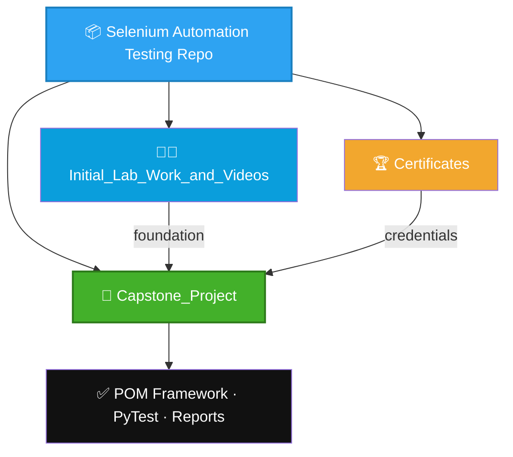

# 🚀 Selenium Automation Testing
### Learning & Project Repository

 

 

 

## 👩‍💻 About Me

<table>
<tr>
<td width="140" align="center">

</td>
<td>

**Chirashree Pan**
🎓 B.Tech — Computer Science & Engineering
🏫 Institute of Engineering and Management, Kolkata
🆔 Enrollment No. `12023002029030`
🧪 Focus: Software Testing & Test Automation

</td>
</tr>
</table>

> This repository documents my complete automation testing journey — from first lab exercises, through professional certifications, to a fully engineered capstone framework.

 

## 🗺️ Repository Map

 

## 📁 Folder Directory

<table width="100%">
<tr>
<th align="left">Folder</th>
<th align="left">What It Contains</th>
<th align="left">Highlights</th>
</tr>

<tr>
<td valign="top">🧑‍💻 <b><a href="./Initial_Lab_Work_and_Videos">Initial_Lab_Work_and_Videos</a></b></td>
<td valign="top">Where the journey began — early hands-on Selenium practice scripts and recorded learning sessions.</td>
<td valign="top">🔹 Foundational exercises 🔹 Practice recordings 🔹 Concept-building scripts</td>
</tr>

<tr>
<td valign="top">🏆 <b><a href="./Certificates">Certificates</a></b></td>
<td valign="top">Verified Coursera credentials proving the skill path from Python to full test automation.</td>
<td valign="top">🐍 Python for Automation — 97.36% 🌐 Selenium WebDriver — 86% 🎭 Playwright &amp; Robot Framework — 80%</td>
</tr>

<tr>
<td valign="top">🧪 <b><a href="./Capstone_Project">Capstone_Project</a></b></td>
<td valign="top">The flagship deliverable — a modular, industry-style Selenium Python automation framework for e-commerce testing.</td>
<td valign="top">🔹 Page Object Model 🔹 PyTest + Unittest 🔹 CSV data-driven tests 🔹 HTML reports &amp; screenshots</td>
</tr>

</table>

 

## 🎯 Skill Progression

| Stage | Milestone | Status |
|:---:|:---|:---:|
| 1️⃣ | Foundational Selenium practice & lab exercises | ✅ |
| 2️⃣ | Python for Automation certification | ✅ |
| 3️⃣ | Selenium WebDriver with Python certification | ✅ |
| 4️⃣ | Playwright & Robot Framework certification | ✅ |
| 5️⃣ | Capstone: full POM automation framework | ✅ |

 

## 🛠️ Tech Stack

<table>
<tr>
<td align="center" width="96">
 Python
</td>
<td align="center" width="96">
 Selenium
</td>
<td align="center" width="96">
 PyTest
</td>
<td align="center" width="96">
 Playwright
</td>
<td align="center" width="96">
 Git
</td>
<td align="center" width="96">
 GitHub
</td>
</tr>
</table>

*Hover over each icon to see its name.*

 

## 🧭 Suggested Path Through This Repo

<b>1. 🧑‍💻 Start with the fundamentals</b>

 
Explore <code>Initial_Lab_Work_and_Videos/</code> to see the early practice scripts and recordings that built the base skills.

<b>2. 🏆 See the credentials behind the skills</b>

 
Check <code>Certificates/</code> for verified Coursera certifications in Python, Selenium, Playwright and Robot Framework.

<b>3. 🧪 Explore the flagship project</b>

 
Dive into <code>Capstone_Project/</code> for the complete Page-Object-Model Selenium framework, source code and demo video.

 

## 📌 Repository Type

**Academic Portfolio — Software Testing & Test Automation**
Developed as part of practical learning and implementation, culminating in a full capstone automation framework.

 

⭐ *If this repository helped you understand test automation, consider giving it a star!* ⭐

